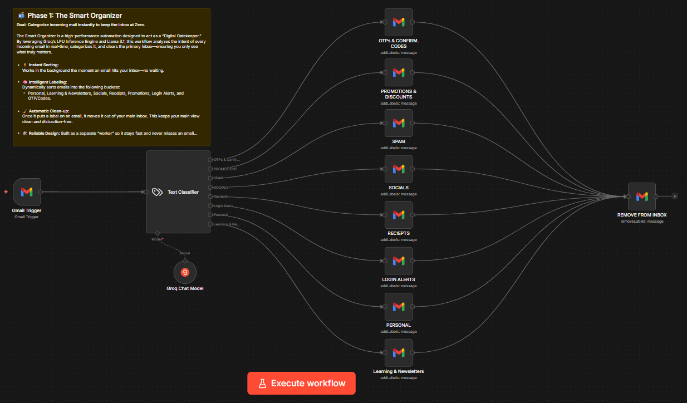
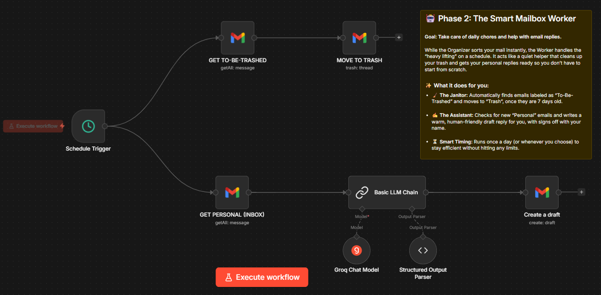

# AI Mailbox Organizer
An AI-powered email automation system using n8n, Docker, and Llama 3. A local automation system that uses **LLMs** to sort and respond to emails.





## 🛠️ Tech Stack
* **n8n:** Workflow automation platform.
* **Docker Desktop:** To run n8n in an isolated, lightweight container.
* **WSL 2:** Windows Subsystem for Linux (for high-performance Docker execution).
* **Google Cloud Console:** For Gmail OAuth 2.0 integration.
* **Groq Cloud:** For lightning-fast Llama 3 inference.

## 🚀 How you can Use
### I. Install Docker & WSL 2
1. Download [Docker Desktop](https://www.docker.com/products/docker-desktop/).
2. During installation, ensure **"Use WSL 2 instead of Hyper-V"** is checked.
3. If Docker asks for a WSL update, open PowerShell as Admin and run:
   
   ```bash
   wsl --update

### II. Launch n8n Locally
- Open your terminal and run the following command to start n8n with persistent data storage:
   
   ```bash
   docker run -d --name n8n-server -p 5678:5678 -v n8n_data:/home/node/.n8n n8nio/n8n

### III. Configure Google Cloud (Gmail API)
To allow n8n to read your emails, you must create a project in the Google Cloud Console:
1. Create a new project and Enable the Gmail API.
2. Configure the OAuth Consent Screen (set it to "External" and add your email to "Test Users").
3. Create OAuth 2.0 Credentials (Web Application).
4. CRITICAL: Add this as an Authorized Redirect URI:
   
   ```bash
   http://localhost:5678/rest/oauth2-credential/callback
   
6. Copy your Client ID and Client Secret into your n8n Gmail node.

### IV. Import the Workflow
This system consists of two interconnected workflows. You must import both for the full automation to work:

The Organizer (organizer.json): **This is the "Brain."** It monitors your inbox, uses the LLM to categorize emails, and applies labels.

The Worker (worker.json): * This is the "Executioner." It acts as an extension of the Organizer to handle specific high-priority tasks, like drafting detailed replies for "Work" emails.

1. Download the mailbox_workflow.json from this repository.
2. In n8n, click the three dots (top right) -> Import from File.
3. **NOTE:** Make sure you have added your Groq API Key and Gmail Credentials to the respective nodes.
4. Make sure you have created the labels (e.g., "Reciepts", "Socials", etc) in your Gmail account so the n8n nodes can find them.
